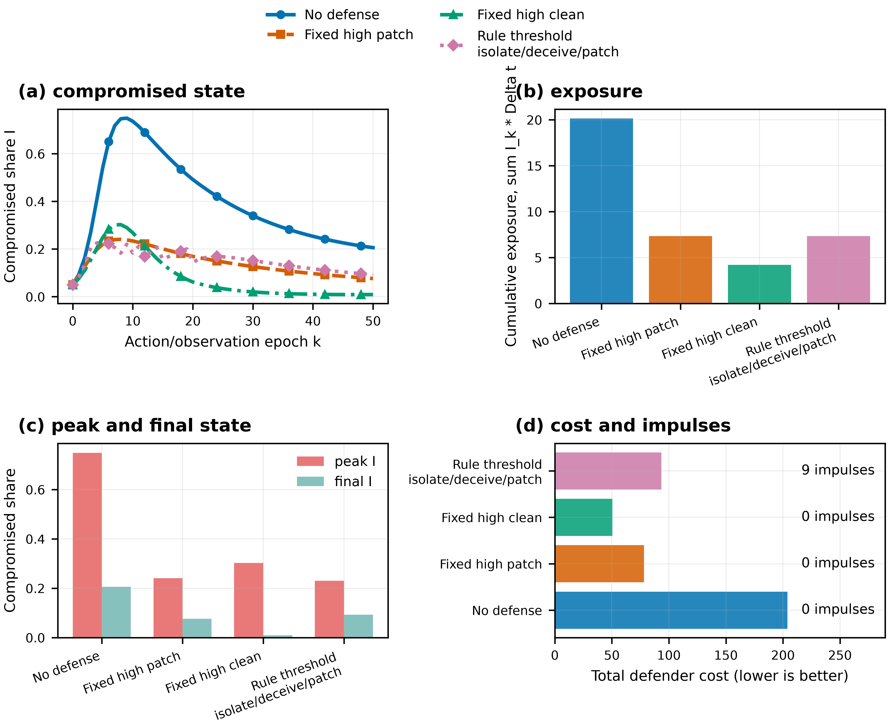

# Cyber Control and Game Learning

Executable material for turning cyber propagation models into sampled-data
MDPs and Markov games, then studying DDQN, actor-critic, CTDE, cooperative MAPPO
and attacker-defender response evaluation. Shared equations and numerical
infrastructure come from the foundation package `cybercontrol`.

The examples are bounded research templates. They do not represent calibrated
networks or establish operational safety or Nash equilibrium.

## Repository Family


| Order | Repository | Responsibility |
|---:|---|---|
| 0 | [Network Control and Differential Games](https://github.com/LYang910920/network-control-differential-games) | Shared equations, heterogeneity, graphs, numerics, FBSM, neural blocks and plotting |
| 1 | **Cyber Control and Game Learning** | Environments, DDQN/PPO, CTDE, cooperative MAPPO and attacker-defender evaluation |
| 2 | [Physics-Informed Cyber Control](https://github.com/LYang910920/note2-pinn-pidl-cyber-control) | Inverse PINN, PIDL, neural control and PMP-informed learning |

## 5-Minute Quick Start

Python 3.10 or newer is required. With sibling checkouts:

```bash
python -m venv .venv
source .venv/bin/activate
python -m pip install --upgrade pip
python -m pip install -e "../network-control-differential-games[torch]"
python -m pip install -e ".[dev]" --no-deps
python -m cybergames smoke
python -m pytest -q
```

For a standalone checkout, `python -m pip install -e ".[dev]"` installs the
reviewed Foundation revision pinned in `pyproject.toml`. The sibling-checkout
commands above remain convenient when developing the repository family together.

```bash
python -m cybergames medium --device auto --output-dir artifacts/medium
python -m cybergames figures
python -m cybergames docs
python -m cybergames all
```

## Code Map

| Need | Start here |
|---|---|
| Main PDF | [`docs/note1_game_learning_cyber_control.pdf`](docs/note1_game_learning_cyber_control.pdf) |
| Models, actions and algorithms | [`docs/METHODS_AND_API.md`](docs/METHODS_AND_API.md) |
| Commands and experiment record | [`docs/REPRODUCIBILITY.md`](docs/REPRODUCIBILITY.md) |
| Paper workflow | [`docs/FROM_MODEL_TO_PAPER.md`](docs/FROM_MODEL_TO_PAPER.md) |
| Public package | [`src/cybergames/`](src/cybergames/) |
| Aggregate environment | [`src/cybergames/envs.py`](src/cybergames/envs.py) |
| DDQN and CTDE | [`ddqn.py`](src/cybergames/ddqn.py), [`ctde.py`](src/cybergames/ctde.py) |
| Node-SIPS environment | [`src/cybergames/node_env.py`](src/cybergames/node_env.py) |
| Budgeted cooperative PPO update | [`src/cybergames/mappo.py`](src/cybergames/mappo.py) |
| Held-out policy evaluation | [`src/cybergames/node_evaluation.py`](src/cybergames/node_evaluation.py) |
| Attacker-defender environment | [`src/cybergames/adversarial_env.py`](src/cybergames/adversarial_env.py) |
| Attacker-defender baselines | [`src/cybergames/adversarial.py`](src/cybergames/adversarial.py) |
| State-conditioned self-play | [`src/cybergames/self_play.py`](src/cybergames/self_play.py) |
| Typed hyperparameters | [`src/cybergames/configs.py`](src/cybergames/configs.py) |
| Literature evidence | [`docs/literature/literature_matrix.csv`](docs/literature/literature_matrix.csv) |

## Representative Experiments

The ODE environment separates policy epochs, internal integration substeps and
explicit reset times. A sampled continuous-valued action remains piecewise
constant under zero-order hold.


The cooperative learning example uses shared community encoders, a centralized
state-value critic, GAE and clipped PPO updates. A coordinator converts local
mode scores into one budget-feasible joint action. This constrained variant is
MAPPO-style, but execution is not strictly decentralized because the allocator
compares communities. Held-out profiles are evaluated against uniform, degree,
risk, oracle and budget-random policies.


The aggregate policy comparison uses one simulator and reports compromised
exposure, peak/final state, defender cost and impulse count. Lower exposure and
cost are better; impulse counts are reported separately.



The current node-SIPS learner is a cooperative, budget-coordinated MAPPO-style
baseline. Heterogeneous attacker-defender learning exists as a separate
state-conditioned actor-critic; it is evaluated with a learned-vs-learned
reference and fixed-policy cross-play against five heuristics. These rollouts
are not labelled best responses or exploitability estimates. It is not
described as attacker-defender MAPPO.

## Extension Route

1. Validate model state, timing, reset and reward semantics before training.
2. Make the policy information structure explicit.
3. Enforce budgets in the action map and also report their use.
4. Compare learned policies with implementable and oracle diagnostics.
5. Test unseen profiles, graphs, sizes, attackers and budgets.
6. Keep shared equations and neural utilities in `cybercontrol`.

The [methods guide](docs/METHODS_AND_API.md) lists architecture shapes,
hyperparameters and the old-to-new import map.

The medium MAPPO experiment compares a shared summary-MLP policy with a
graph-context policy under the same one-community action budget. Their combined
actor-plus-critic parameter counts are matched and recorded in the run manifest.

## Validation

```bash
python -m compileall -q src tests scripts
python -m ruff check src tests scripts
python -m pytest -q
python -m cybergames smoke
python -m cybergames figures
python -m cybergames docs
```

The five-seed medium profile and output checks are documented in
[`docs/REPRODUCIBILITY.md`](docs/REPRODUCIBILITY.md).

## Citation and License

Code, documentation and generated figures are MIT-licensed unless a file says
otherwise. See [`LICENSE`](LICENSE) and [`NOTICE.md`](NOTICE.md). Cite the
foundation repository when using `cybercontrol` and cite the relevant paper or
method source recorded in `docs/literature/`.
