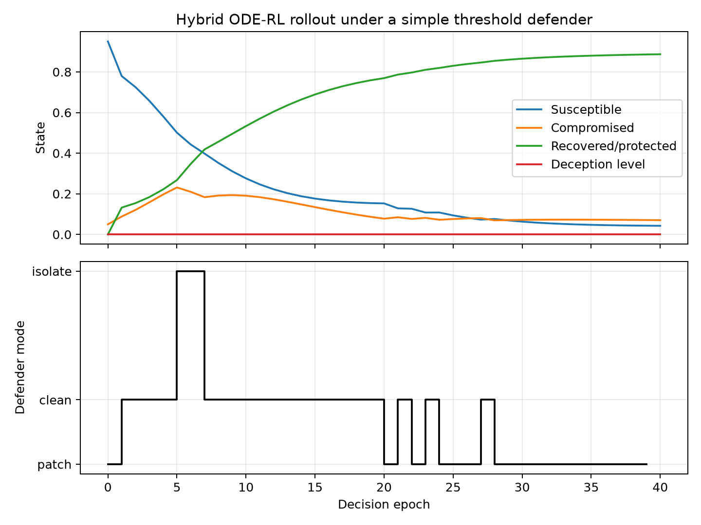

# Cyber Control and Game Learning, Note 1

This repository is the executable companion for **Note 1: Game Learning for Cyber Control**.  It collects compact Python examples for continuous-time cyber-control models, PMP/FBSM baselines, sampled-data reinforcement learning, and attacker-defender Markov games.

The examples are intentionally small and readable.  They are meant for study, modification, and sanity-checking research ideas before moving to a larger RL or MARL framework.

## Start Here

If this is your first time opening the repo, read `START_HERE.md` first.  It gives a five-minute path, a file finder, and the recommended code-reading order.

For a one-page bird's-eye view of the folders, code flow, command flow, and outputs, read `PROJECT_MAP.md`.

## Repository Map

| Path | Purpose |
|---|---|
| `START_HERE.md` | First-stop guide for new readers. |
| `PROJECT_MAP.md` | One-page map of folders, code flow, commands, and outputs. |
| `docs/note1_game_learning_cyber_control.pdf` | Main lecture note for game learning and cyber control. |
| `docs/README.md` | Reading path and lecture-structure guide. |
| `docs/implementation_companion.pdf` | Companion explanation for implementation choices. |
| `docs/code_run_guide.pdf` | General run guide from the original bundle. |
| `docs/LEARNING_PATH.md` | How this repo connects to the differential-games and PINN/PIDL repos. |
| `docs/EXTENDING.md` | How to extend the examples to richer models and large network settings. |
| `src/README.md` | Source-code map and state conventions. |
| `src/cyber_dynamics.py` | Shared RK4 integration and malware dynamics utilities. |
| `src/cyber_hybrid_env.py` | Hybrid cyber-defense environment with flow, jump, and mixed actions. |
| `src/fbsm_malware_baseline.py` | Forward-backward sweep method for a PMP malware-control baseline. |
| `src/ddqn_cyber_defense.py` | DDQN defender for a sampled-data ODE cyber-defense MDP. |
| `src/madrl_ctde_hybrid_game.py` | Minimal CTDE/MADRL attacker-defender game example. |
| `scripts/README.md` | Command guide for validation, figures, and longer diagnostics. |
| `scripts/generate_figures.py` | Generates explanatory figures in `figures/`. |
| `scripts/run_training_iterations.py` | Runs longer teaching diagnostics and writes CSV histories in `experiments/`. |
| `scripts/run_smoke_tests.sh` | Runs all fast checks for this repo. |
| `.github/workflows/smoke-tests.yml` | GitHub Actions workflow for dependency install, smoke tests, and figure generation. |
| `experiments/` | Small training-iteration CSV outputs and an explanation of each metric. |
| `tests/` | Small regression tests for dynamics, environment contracts, and FBSM output. |
| `LICENSE` and `NOTICE.md` | MIT license, copyright, and attribution notes. |

## Quick Start

```bash
python -m venv .venv
source .venv/bin/activate
pip install --upgrade pip
pip install -r requirements.txt
```

Run the full smoke check:

```bash
bash scripts/run_smoke_tests.sh
```

Generate the figures used in this README:

```bash
python scripts/generate_figures.py
```

Run longer training-iteration diagnostics:

```bash
python scripts/run_training_iterations.py
```

## What You Need And What You Get

| Question | Answer |
|---|---|
| What do I need to install? | Python, NumPy, PyTorch, and Matplotlib from `requirements.txt`. |
| What should I run first? | `bash scripts/run_smoke_tests.sh`. |
| What does a successful run prove? | The dynamics, learning loops, tests, and figure-generation scripts execute in this environment. |
| What files should I inspect after training? | `experiments/training_summary.md`, the CSV files in `experiments/`, and `figures/training_iteration_diagnostics.png`. |
| Where do I learn how to extend the model? | `docs/EXTENDING.md`. |
| Where is the larger network-control foundation? | `docs/LEARNING_PATH.md` links this repo to `network-control-differential-games`. |

## Common Workflows

| Goal | Command or file |
|---|---|
| Check that everything runs | `bash scripts/run_smoke_tests.sh` |
| Get the big-picture structure | `PROJECT_MAP.md` |
| Rebuild README figures | `python scripts/generate_figures.py` |
| Rebuild convergence diagnostics | `python scripts/run_training_iterations.py` |
| Increase training time | `python scripts/run_training_iterations.py --episodes 300` |
| Understand module responsibilities | `src/README.md` |
| Understand command outputs | `scripts/README.md` |
| Extend to network-scale models | `docs/EXTENDING.md` |
| Follow the cross-repo sequence | `docs/LEARNING_PATH.md` |

## Main Ideas

This repo separates three levels that are easy to blur:

1. **Continuous-time control**: `fbsm_malware_baseline.py` solves an open-loop PMP system for one initial condition.
2. **Sampled-data RL**: `cyber_hybrid_env.py` converts ODE flow and impulsive actions into a reset/step interface, while `ddqn_cyber_defense.py` learns a discrete defender policy.
3. **Attacker-defender games**: `madrl_ctde_hybrid_game.py` uses decentralized actors and centralized critics to make the Markov-game training loop explicit.

## Figures

`figures/neural_architectures.png` summarizes the two neural-learning patterns in this note: DDQN for the defender and CTDE/MADRL for attacker-defender learning.


`figures/fbsm_malware_control.png` shows the FBSM baseline: malware compartments and the optimized patching intensity.


`figures/hybrid_policy_comparison.png` compares no-defense, fixed-defense, and adaptive hybrid policies on the same scripted-attacker scenario.


`figures/hybrid_policy_rollout.png` shows a simple hybrid rollout where the defender switches among patching, cleaning, and isolation decisions while the attacker follows a scripted policy.



## Training Diagnostics

`scripts/run_training_iterations.py` writes three experiment tables and a summary:

| CSV | What to inspect |
|---|---|
| `experiments/fbsm_iteration_history.csv` | Whether the control update stabilizes as `max_control_change` falls. |
| `experiments/ddqn_training_history.csv` | Whether evaluation return improves while epsilon decays. |
| `experiments/madrl_training_history.csv` | Whether the CTDE loss, entropy, and defender/attacker returns stay numerically stable. |
| `experiments/training_summary.md` | First-versus-last diagnostic values and interpretation. |

The default run is intentionally longer than smoke mode.  FBSM should show clear numerical convergence.  DDQN should be read through the rolling evaluation trend.  CTDE/MADRL is included as a stability diagnostic because short stochastic game training is not an equilibrium proof.

The combined plot is:


## Validation

The repo includes smoke tests for every executable script and unit tests for the core numerical contracts.  It also has a GitHub Actions workflow that installs dependencies, runs smoke tests, and regenerates figures on push or pull request.

This consolidated version keeps the Note 1 PDFs, source materials, generated figures, tests, CI workflow, and longer teaching diagnostics in one final repo.

These examples are teaching code, not benchmark implementations.  For serious experiments, add multiple seeds, stronger baselines, full logging, and exploitability-style game diagnostics.

## Related Repository

For the optimal-control and differential-game foundation behind the FBSM and hybrid-control pieces, see:

https://github.com/LYang910920/network-control-differential-games

Use that repository first for degree-level, node-level, and hybrid impulse examples.  Then use this repository to study sampled-data RL and attacker-defender learning on cyber-control dynamics.

## License And Copyright

This repository is released under the MIT License.  See `LICENSE` for the full terms and `NOTICE.md` for copyright, dependency, and attribution notes.
