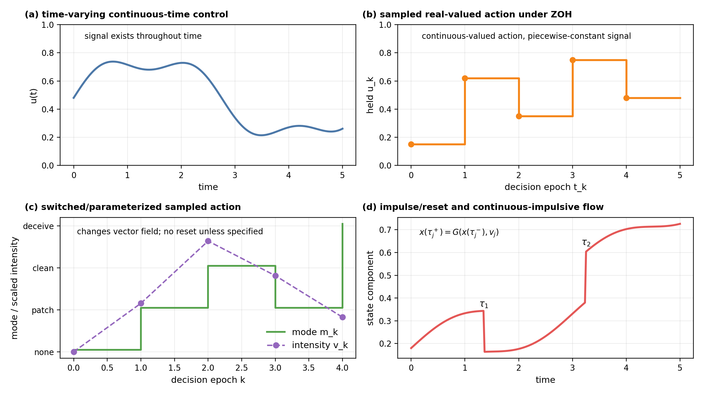
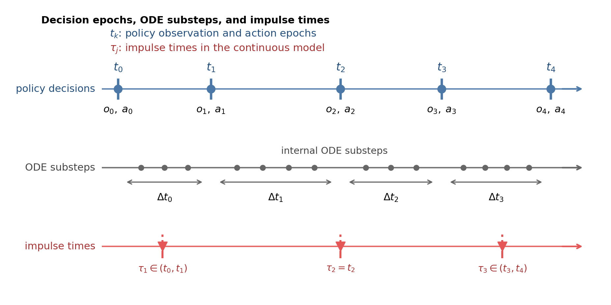
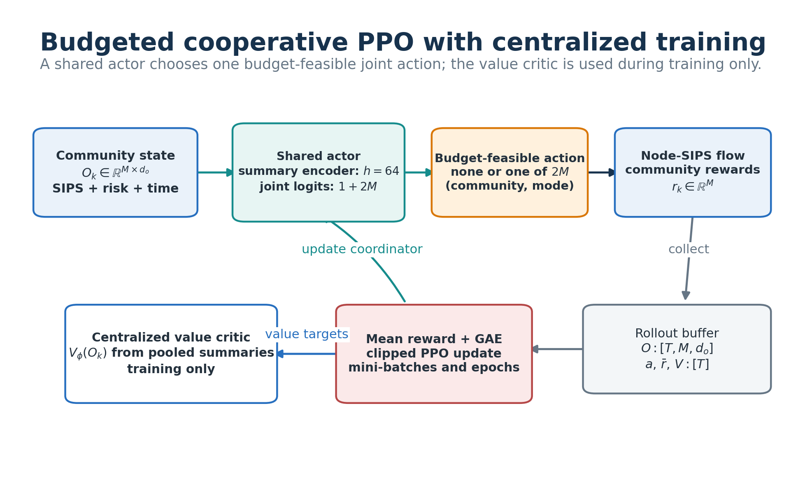
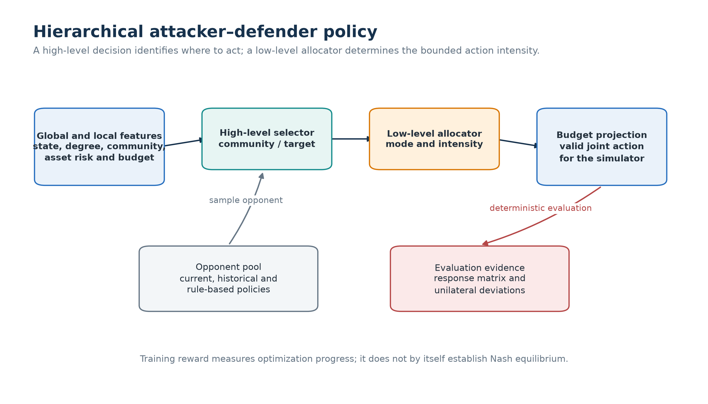

# Cyber Control and Game Learning

Sampled-data environments and learning methods for cyber propagation models.
The repository covers DDQN, actor-critic, CTDE, cooperative budgeted MAPPO-style
learning and attacker-defender response evaluation. Shared equations, neural
blocks and numerical utilities come from `cybercontrol`.

It answers three questions:

- How does a continuous-time model become an MDP or Markov game?
- Which DDQN/PPO/MAPPO components are implemented, and what do they observe?
- Which held-out and response diagnostics support a cautious learning claim?

The simulators are bounded research templates. They do not establish operational
safety, exploitability or Nash equilibrium.

## Repository Family


| Order | Repository | Responsibility |
|---:|---|---|
| 0 | [Network Control and Differential Games](https://github.com/LYang910920/network-control-differential-games) | Shared equations, heterogeneity, graphs, FBSM, neural utilities and plotting |
| 1 | **Cyber Control and Game Learning** | Sampled environments, DDQN/PPO, CTDE, MAPPO and game evaluation |
| 2 | [Physics-Informed Cyber Control](https://github.com/LYang910920/note2-pinn-pidl-cyber-control) | Inverse PINN, PIDL, neural control and PMP-informed learning |

New readers should follow the Foundation
[Learning Path](https://github.com/LYang910920/network-control-differential-games/blob/main/docs/LEARNING_PATH.md)
before changing an environment or reward.

## First Run

Python 3.10 or newer is required. With sibling checkouts, install the reviewed
Foundation and this repository:

```bash
python -m pip install -e "../network-control-differential-games[torch]"
python -m pip install -e ".[dev]" --no-deps
```

Then run the bounded CPU smoke check, normally well under one minute:

```bash
python -m cybergames smoke
```

## Expected Output

| Output | Interpretation |
|---|---|
| `artifacts/smoke_summary.json` | FBSM mass/objective, short DDQN/CTDE histories, MAPPO action count, Git and hardware provenance |
| terminal exit code `0` | Environment, learning and invariant checks completed without an exception |

The smoke reward is not a benchmark result. Use it to verify data flow, shapes
and reproducibility before a medium run.

## Read These Two Files

1. [`src/cybergames/node_env.py`](src/cybergames/node_env.py): heterogeneous
   node-SIPS observation, budgeted action, ODE transition and reward.
2. [`src/cybergames/mappo.py`](src/cybergames/mappo.py): rollout collection,
   GAE, minibatches and clipped PPO update.

Exact action semantics, tensor shapes and hyperparameters are listed in
[`docs/METHODS_AND_API.md`](docs/METHODS_AND_API.md).

## Change One Thing

Raise `NodeSIPSEnvConfig.beta` in
[`configs.py`](src/cybergames/configs.py), then rerun the same seed. Faster
transmission should increase uncontrolled exposure; the learned-policy effect
must be measured because reward, action cost and the budget interact.

## Control Timing

Decision epochs, ZOH flow and impulse/reset times are separate parts of the
environment contract. A sampled real-valued action is not automatically a
continuously varying control, and a mode change is not an impulse without a
state reset.





## Medium Experiment

Run the five-seed DDQN/baseline and cooperative/adversarial learning profile:

```bash
python -m cybergames medium --device auto --output-dir artifacts/medium
```

Inspect:

- `artifacts/medium/medium_metrics.csv` for returns, exposure, mass and held-out
  policy comparisons;
- `artifacts/medium/medium_config.json` for seeds, architectures, hardware and
  parameter counts.

The cooperative learner uses a centralized value critic and a coordinator that
maps local scores to one budget-feasible joint action. It is MAPPO-style, but
execution is not strictly decentralized because communities are compared by the
allocator.



The attacker-defender learner is a separate state-conditioned actor-critic.
Fixed-policy cross-play is evaluation evidence, not a best-response or
exploitability calculation.



## Next Experiment

Train on one heterogeneity range and evaluate unseen parameter seeds, graph
seeds, one unseen size and a tighter action budget. Compare uniform, degree,
risk, oracle and budget-random policies under the same budget. The complete
recording protocol is in
[`docs/REPRODUCIBILITY.md`](docs/REPRODUCIBILITY.md).

## Extension Route

1. Validate SIPS mass, adjacency orientation, ZOH timing and reset-only jumps.
2. State exactly what each actor and the training critic observe.
3. Keep operational budgets in the action map and report their use separately.
4. Report exposure, peak/final infection, criticality-weighted loss, action cost
   and response/deviation evidence, not reward alone.
5. Put shared equations or neural utilities in the Foundation only when another
   real caller needs them.

The repository-specific paper checklist is
[`docs/FROM_MODEL_TO_PAPER.md`](docs/FROM_MODEL_TO_PAPER.md).

## Validation

The maintained install, test, figure and PDF commands are in
[`docs/REPRODUCIBILITY.md`](docs/REPRODUCIBILITY.md). Tests cover timing,
rewards, deterministic seeds, action budgets, GAE/MAPPO shapes and SIPS mass.

## Citation and License

Code, documentation and generated figures are MIT-licensed unless a file says
otherwise. See [`LICENSE`](LICENSE) and [`NOTICE.md`](NOTICE.md). Cite the
Foundation for `cybercontrol` and the relevant method source recorded under
`docs/literature/`.
