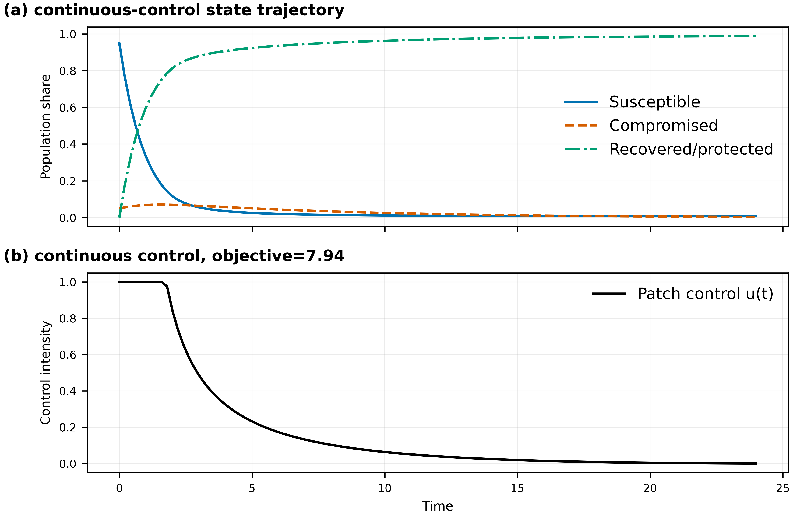
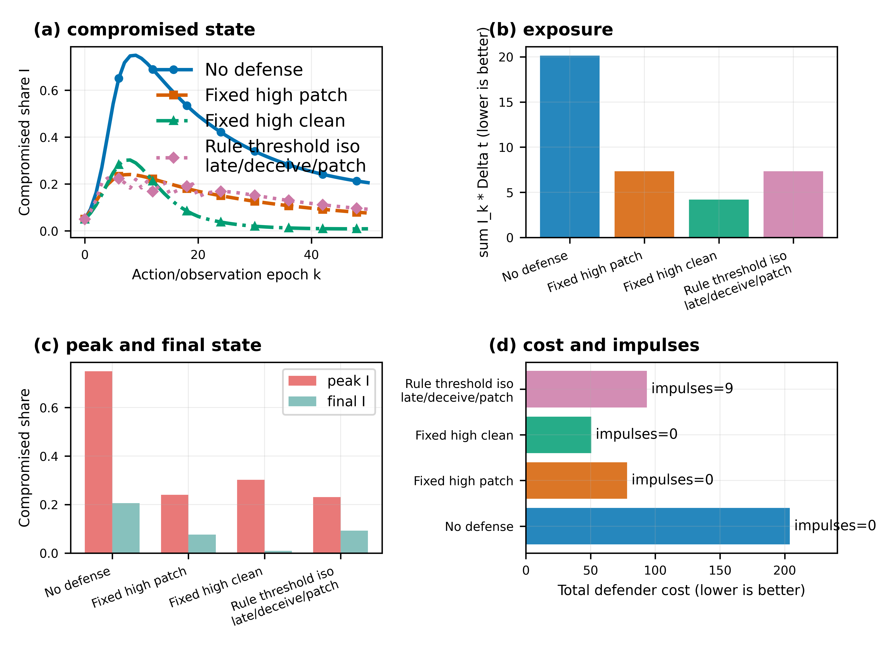
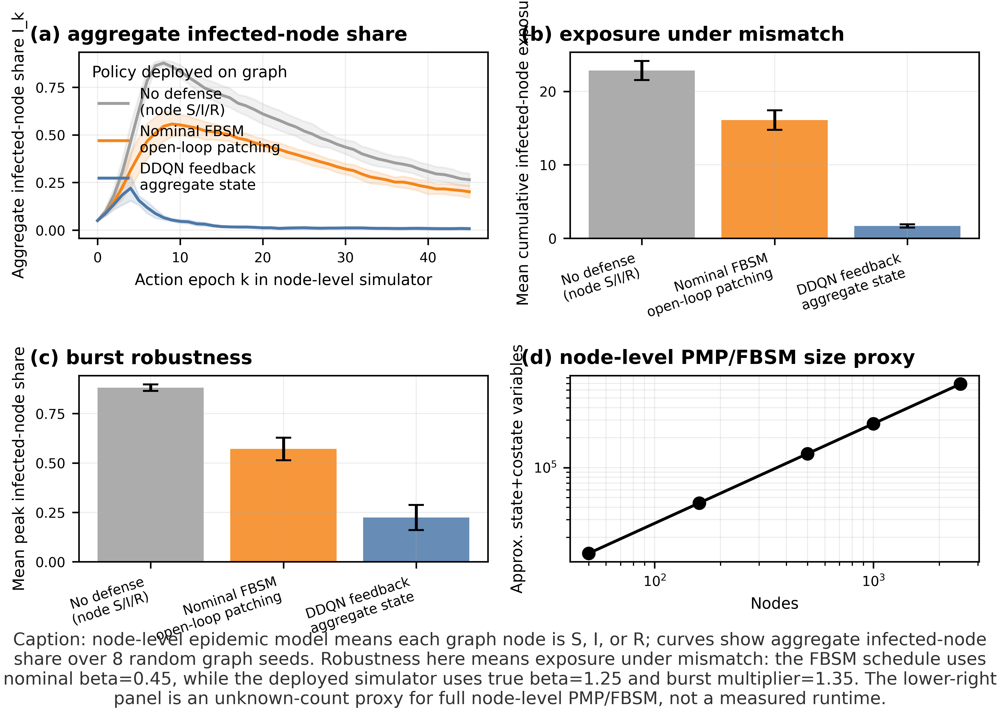

# Cyber Control and Game Learning

Executable code for cyber optimal control, sampled-data reinforcement learning, and attacker-defender game learning. This is the second repository in the family. It uses the foundation package `cybercontrol` for shared dynamics, integration, plotting, and neural helper blocks; this repository keeps the environment and learning code.

## Repository Family

| Order | Repository | Role |
|---:|---|---|
| 0 | [network-control-differential-games](https://github.com/LYang910920/network-control-differential-games) | Foundation notation, shared `cybercontrol` package, continuous/impulse/hybrid examples, degree-vs-node scalability, and reference smoke runs. |
| 1 | `note1-cyber-control-games` | FBSM baseline, sampled-data MDP conversion, DDQN defense, CTDE attacker-defender learning, cooperative node-SIPRS MAPPO, and larger node-SIPRS attacker-defender benchmarks. |
| 2 | [note2-pinn-pidl-cyber-control](https://github.com/LYang910920/note2-pinn-pidl-cyber-control) | PINN/PIDL inverse learning, neural control, PMP-informed losses, and graph-state residual examples. |

## 5-Minute Quick Start

```bash
python -m venv .venv
source .venv/bin/activate
python -m pip install --upgrade pip
python -m pip install -e "../network-control-differential-games[torch,dev]"
python -m pip install -e ".[dev]"
python run_all.py smoke
python run_all.py figures
```

If this repository is cloned without the sibling foundation repo:

```bash
python -m pip install "cybercontrol[torch] @ git+https://github.com/LYang910920/network-control-differential-games.git"
python -m pip install -e ".[dev]"
```

For bounded diagnostics that write local artifacts:

```bash
python run_all.py train
```

## Code Map

| Need | Start here |
|---|---|
| Tutorial PDF | `docs/note1_game_learning_cyber_control.pdf` |
| Run and implementation guide | `docs/code_run_guide.pdf`, `docs/implementation_companion.pdf` |
| Parameters and hyperparameters | `docs/PARAMETERS.md` |
| MDP, Markov-game, and impulse timing | `docs/MODEL_TO_MDP.md` |
| Paper workflow and extensions | `docs/PAPER_WORKFLOW.md`, `docs/EXTENDING.md` |
| Aggregate cyber environment | `src/cyber_hybrid_env.py` |
| FBSM baseline | `src/fbsm_malware_baseline.py` |
| DDQN and CTDE | `src/ddqn_cyber_defense.py`, `src/madrl_ctde_hybrid_game.py` |
| Heterogeneous cooperative node-SIPRS MAPPO | `src/node_siprs_mappo.py` |
| Larger heterogeneous node-SIPRS attacker-defender game | `src/node_siprs_adversarial_large.py` |
| Static figures and bounded diagnostics | `scripts/generate_figures.py`, `scripts/run_training_iterations.py` |

## Capability Status

| Capability | API / file | Command | Metrics | Validation status |
|---|---|---|---|---|
| Heterogeneous node-SIPRS cooperative MAPPO | `src/node_siprs_mappo.py` | `python run_all.py mappo --policy-csv artifacts/extended_validation/mappo_policy.csv` | reward, infected exposure, peak/final infection, mass error | community defenders observe local state plus risk/rate summaries |
| Uniform/degree/risk/oracle/budget-random baselines | `baseline_actions`, `evaluate_policy_baselines` | same command with `--policy-csv` | cumulative infected exposure and action count | budget-matched one-community intervention per epoch |
| Held-out seeds and heterogeneity strengths | `evaluate_policy_baselines` | same command | policy metrics across seeds 101-105 and strengths 0.2/current/0.5 | runs on unseen profiles after training |
| Larger heterogeneous attacker-defender node-SIPRS benchmark | `src/node_siprs_adversarial_large.py` | `python run_all.py large-game --response-csv artifacts/extended_validation/large_game_response.csv` | defender/attacker payoff, infected exposure, response matrix, mass error | sparse graph, community budgets, self-play softmax policies |

## Representative Experiments

The FBSM baseline solves a continuous-time malware-control problem and produces a continuous patching intensity over time.



The hybrid policy comparison evaluates no defense, fixed defenses, and a rule-based hybrid policy on the same simulator. Lower compromised exposure is better.



The node-level robustness example deploys a nominal open-loop FBSM schedule and a DDQN feedback policy on stochastic node-level epidemic rollouts. Here robustness means lower infected-node exposure under parameter mismatch, not a formal guarantee. The cooperative MAPPO environment uses the foundation SIPRS equations with community-correlated susceptibility, infectivity, recovery, criticality, costs, bounds, and efficacy. The larger attacker-defender benchmark uses the same SIPRS semantics on a sparse graph, adds attacker beta-boost actions, and reports a response matrix against uniform, degree, risk, oracle, random, and learned community policies.



## Extension Route

1. Read `docs/PARAMETERS.md` to locate the model, solver, and neural-training settings.
2. Edit one method at a time: environment dynamics, reward/payoff, policy class, or training profile.
3. Keep shared numerics and plotting in the foundation package `cybercontrol`; add Note 1 code only for game-learning behavior.
4. Run `python run_all.py smoke` after each structural change.
5. Use `python run_all.py train` for bounded diagnostics. Outputs go to ignored `artifacts/experiments/` and `artifacts/figures/`.

## Validation

```bash
python -m compileall -q src tests scripts
python -m pytest -q
python run_all.py smoke
python run_all.py figures
```

Extended local diagnostic run:

```bash
python run_all.py train --profile teaching --episodes 240 --device cpu
```

In this run, FBSM control updates converged, DDQN evaluation return improved from about -76.6 to -20.6, and the node-level robustness comparison reported mean infected-node exposure 1.677 for DDQN feedback versus 16.111 for the nominal-beta FBSM open-loop schedule.

GitHub Actions runs the smoke tests on pushes and pull requests. The examples are teaching baselines, not calibrated cyber-risk models.

## Citation and License

See `LICENSE` and `NOTICE.md`. When using the repository in a paper or report, cite the related publication and the foundation repository when its shared package is used.
