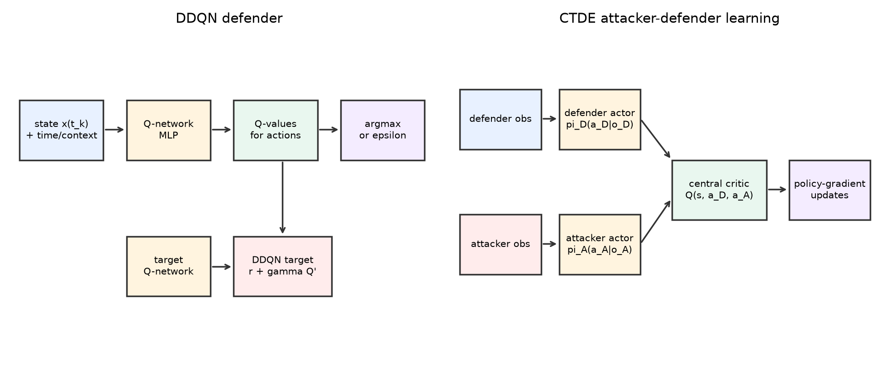
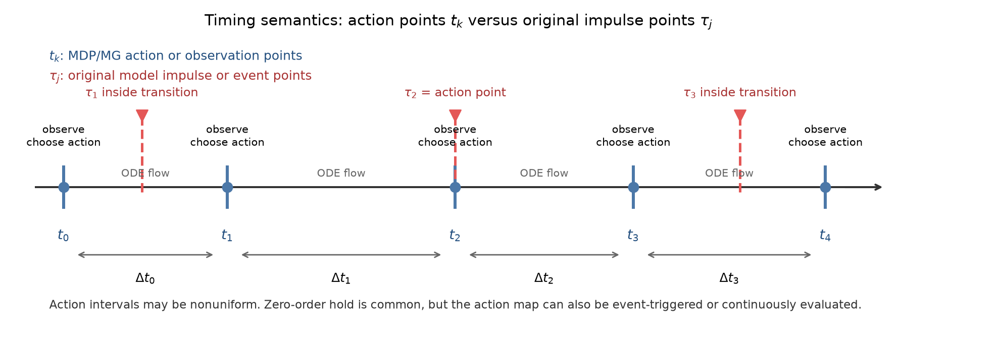
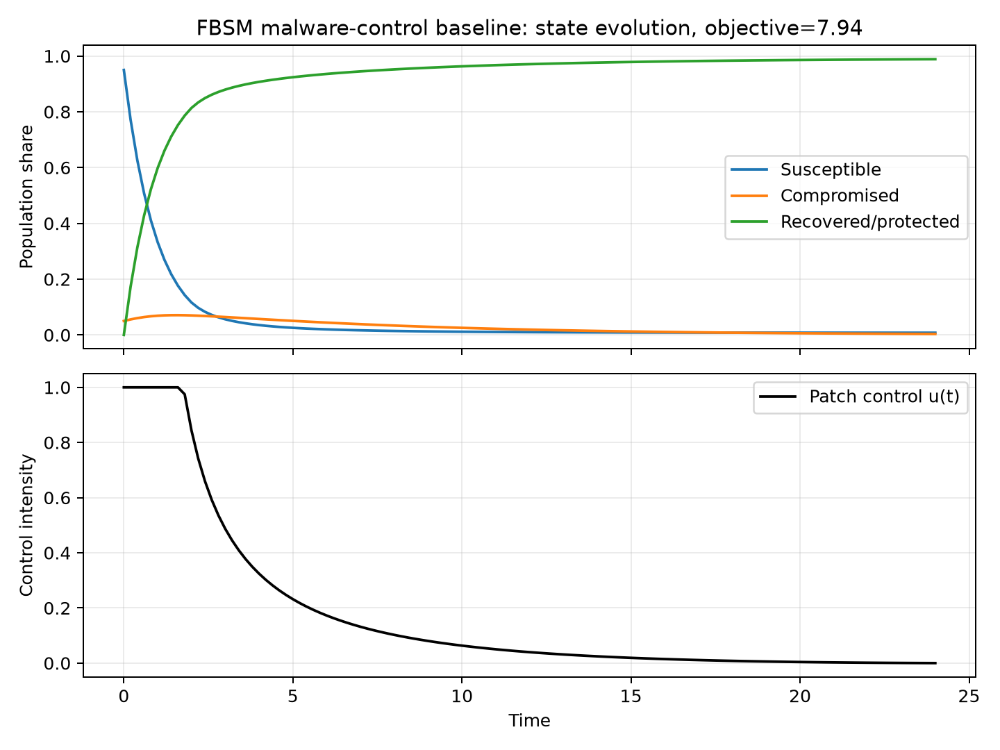
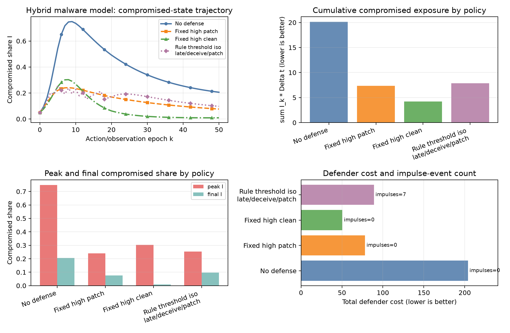
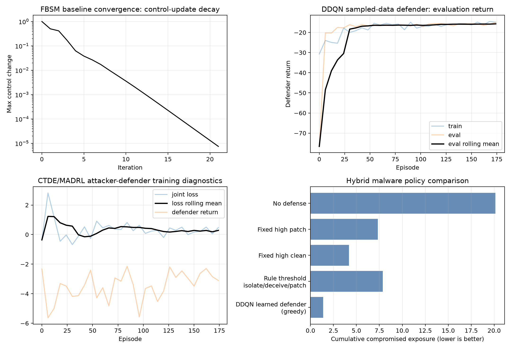
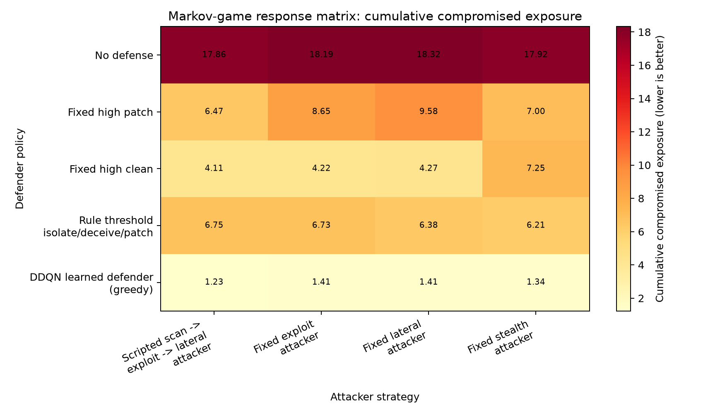
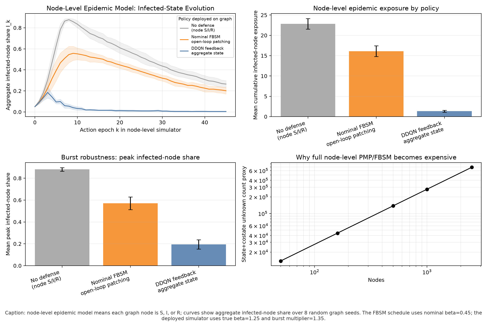

# Cyber Control and Game Learning, Note 1

Executable companion for **Note 1: Game Learning for Cyber Control**.  The repo keeps the teaching path small: continuous-time cyber dynamics, an FBSM optimal-control baseline, DDQN defense learning, and a compact attacker-defender CTDE/MADRL example.

The main goal is to show how one cyber propagation model can be studied from three angles: classical optimal control, sampled-data reinforcement learning, and multi-agent game learning.  Each example is short enough to read directly, but still produces figures and logs that make the numerical behavior visible.

The repository is especially careful about timing: continuous flow happens between decision points, impulse actions can create immediate state jumps, and the DDQN/MADRL examples expose only the sampled decision points as MDP or Markov-game observations.

If this is your first visit, start with `START_HERE.md`.

## Quick Start

```bash
python -m venv .venv
source .venv/bin/activate
pip install --upgrade pip
pip install -r requirements.txt
bash scripts/run_smoke_tests.sh
python scripts/generate_figures.py
```

For longer convergence/stability diagnostics:

```bash
python scripts/run_training_iterations.py
```

## Repository Guide

| Need | Open |
|---|---|
| Short orientation | `START_HERE.md` |
| Lecture narrative | `docs/note1_game_learning_cyber_control.pdf` |
| Continuous/impulse/MDP guide | `docs/MODEL_TO_MDP.md` |
| Source-code map | `src/README.md` |
| Script and output map | `scripts/README.md` |
| Training curves and CSVs | `experiments/README.md` |
| Extensions and scaling | `docs/EXTENDING.md` |
| License and attribution | `LICENSE`, `NOTICE.md` |

## Core Flow

```text
cyber ODE dynamics
  -> FBSM continuous-control baseline
  -> hybrid ODE/RL environment
  -> DDQN defender
  -> CTDE/MADRL attacker-defender game
```



## Timing Convention

The hybrid environment uses one clear transition order:

```text
observe x(t_k^-)
  -> choose action(s)
  -> apply impulse jump x(t_k^+) if needed
  -> integrate continuous ODE over [t_k, t_{k+1})
  -> return x(t_{k+1}^-) as the next observation
```

FBSM solves a continuous-time optimal-control problem on a numerical mesh; it does **not** create an MDP.  DDQN and CTDE/MADRL convert the simulator into a sampled-data MDP or Markov game, where `EnvConfig.dt` is the decision interval and RK4 `substeps` are only internal integration steps.  See `docs/MODEL_TO_MDP.md` for the full mapping.

In the notation used here, `t_k` means a learning action/observation point after converting the model into an MDP or Markov game.  `tau_j` means an impulse or event point already present in the original model.  The code uses a fixed `Delta t` for readability, but the method can also use nonuniform action intervals `Delta t_k`.



## What You Learn

| Topic | In this repo |
|---|---|
| Continuous-time modeling | Malware spread is represented by ODE state variables and control inputs. |
| Optimal-control baseline | FBSM gives a deterministic reference policy before learning is introduced. |
| Impulse and hybrid control | Some modes change continuous rates; isolation creates an immediate jump at `t_k`. |
| Hybrid RL | The ODE and jump map are wrapped into a sampled-data MDP for DDQN. |
| Game learning | Defender and attacker decisions form a sampled-data Markov game for CTDE/MADRL. |

## Representative Experiments

The FBSM example gives a classical control baseline: the state trajectory and patching intensity show how the controller suppresses the infected compartment over time.



The hybrid policy comparison rolls out the same cyber scenario under no defense, fixed defenses, a named rule-based hybrid policy, and the learned DDQN policy in the training diagnostics.  It compares multiple metrics, including compromised trajectory, cumulative compromised exposure, peak/final compromised share, defender cost, and impulse usage.



The training diagnostics plot summarizes longer teaching runs.  FBSM should show the clearest convergence; DDQN and CTDE/MADRL should be read as stochastic learning/stability diagnostics rather than formal equilibrium proofs.



The game response matrix compares defender policies against several attacker strategies.  Each cell reports cumulative compromised exposure, so lower values are better.



The node-level epidemic-model robustness experiment shows a case where a low-dimensional open-loop FBSM schedule is computed with an underestimated propagation parameter, then deployed on a stochastic graph.  Here **node-level** means every graph node has a local S/I/R epidemic state; the plotted curve is the aggregate infected-node share over action epochs.  The DDQN aggregate feedback policy observes the current infected-node share and reacts to bursts, so the figure is a concrete example of when feedback learning can be more practical than an offline baseline.



## Main Outputs

| Output | Purpose |
|---|---|
| `figures/timing_semantics.png` | nonuniform action points `t_k` versus original impulse points `tau_j` |
| `figures/fbsm_malware_control.png` | FBSM state and patching-control baseline |
| `figures/hybrid_policy_comparison.png` | no-defense, fixed-defense, and rule-based hybrid-policy comparison |
| `figures/hybrid_policy_rollout.png` | one hybrid rollout with defender and attacker actions |
| `figures/training_iteration_diagnostics.png` | longer FBSM, DDQN, and CTDE/MADRL diagnostics |
| `figures/game_response_matrix.png` | defender-policy performance against several attacker strategies |
| `figures/node_level_learning_advantage.png` | node-level epidemic-model parameter-mismatch comparison: DDQN feedback versus nominal-beta FBSM |
| `experiments/OUTPUT_PREVIEW.md` | categorized first-stop summary after longer experiment runs |
| `experiments/policy_comparison_metrics.csv` | multi-metric comparison of representative defense policies |
| `experiments/game_response_metrics.csv` | game-style attacker-defender response metrics |
| `experiments/node_level_robustness_metrics.csv` | node-level epidemic-model robustness metrics over multiple random graph seeds |
| `experiments/*.csv` | logged histories behind the training plot |

## Validation

`bash scripts/run_smoke_tests.sh` runs the fast local check.  GitHub Actions repeats the smoke tests and regenerates figures on each push or pull request.

These examples are teaching code, not benchmark implementations.  For research use, add multiple seeds, stronger baselines, full logging, and game-specific exploitability or unilateral-deviation checks.

## Related Repository

For the optimal-control and differential-game foundation behind the FBSM and hybrid-control pieces, see https://github.com/LYang910920/network-control-differential-games.

## License And Copyright

Released under the MIT License.  See `LICENSE` for terms and `NOTICE.md` for copyright, dependency, and attribution notes.
