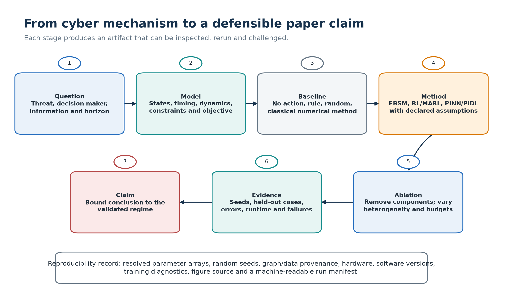

# From Environment to Paper

## 1. Fix the information structure

List what each defender and attacker observes at `t_k`, what remains hidden,
whether agents share observations during execution, and what extra state the
central critic receives during training. Known parameter-risk summaries are
valid observations only when the deployment setting makes them available.

## 2. Validate the simulator before training

Check SIPS conservation, nonnegativity, adjacency orientation, ZOH equivalence,
reset-only jumps, reward decomposition and action-budget enforcement. Compare
the same trajectory against a smaller integration step. A policy cannot repair
an invalid environment.

## 3. Establish baselines

For cooperative defense, include uniform, degree/centrality, parameter-risk,
oracle-current-state and budget-matched random policies. For attacker-defender
learning, include fixed/rule opponents, static policy baselines and cross-play.
The oracle is a diagnostic upper reference, not an implementable operational
policy when it uses hidden infection state.

## 4. Train and record diagnostics

Log policy/value losses, entropy, clip fraction, advantage statistics, gradient
norm, active actions, sample count and wall time. Keep training and evaluation
seeds separate. Select checkpoints without reading the held-out test profiles.

## 5. Evaluate beyond reward

Report infected exposure, peak/final infection, criticality-weighted loss,
action count/cost, constraint violations and per-node mass error. For a game,
report both payoffs, a response matrix and unilateral deviation gaps. Nash
stability is a property of responses, not the shape of the training curve.

## 6. Test generalization

Use unseen parameter seeds and strengths, at least two graph families, an unseen
size, attacker shifts and action-budget stress. State whether observations still
contain the risk information used during training. Five seeds are the minimum
bounded profile in this repository; paper claims may require more.

## 7. Write the result with a bounded claim

Connect each figure to a saved configuration and metric table. Caption the state
aggregation (selected node, community mean or all-node mean), action timing and
whether lower or higher is better. Separate simulator evidence from claims about
real networks.

The evidence matrix under `docs/literature/` records which architecture and
evaluation choices come from reviewed full text, abstract-only triage or a
requested PDF. In particular, MAPPO evidence supports a cooperative baseline;
it does not establish attacker-defender equilibrium or cyber safety.
