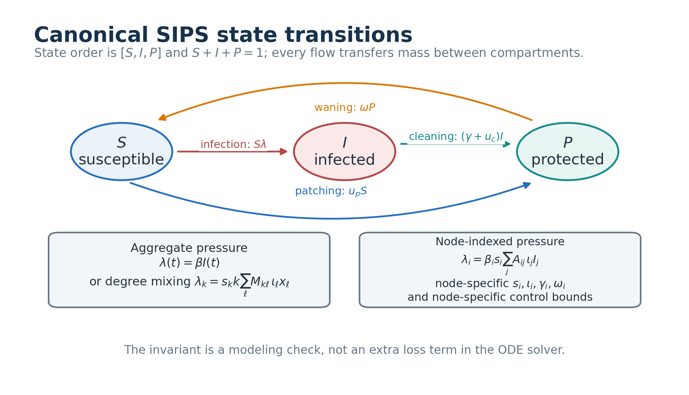
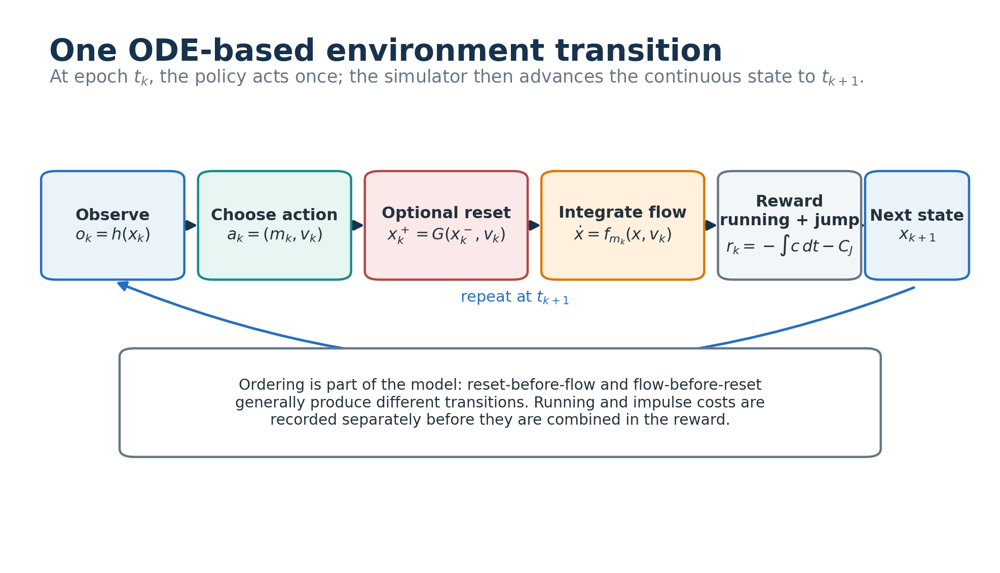
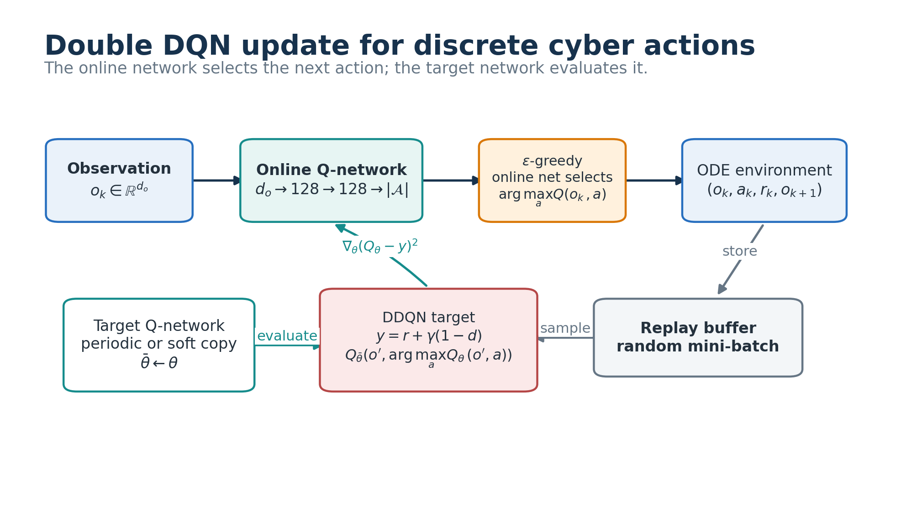

# Methods and Public API

Note 1 starts with cyber dynamics and action timing, converts the simulator to
an MDP or Markov game, and then introduces DDQN, PPO-style actor-critic, CTDE
and MAPPO. Detailed PMP/FBSM remains in the foundation repository; detailed
PINN/PIDL remains in Note 2.

## Dynamics before learning

The canonical node model is SIPS with state order `[S_i, I_i, P_i]` and
`S_i + I_i + P_i = 1`. For node `i`, infection pressure is

```text
lambda_i = beta_i * susceptibility_i * sum_j A_ij * infectivity_j * I_j.
```

Patching moves susceptible mass to protected, cleaning moves infected mass to
protected, and waning returns protected mass to susceptible. The foundation
package resolves node-specific recovery, waning, criticality, control costs,
bounds and efficacy. Note 1 does not implement another SIPS equation.



## From flow to an environment transition

At decision epoch `t_k`, the policy observes `o_k`, selects one action, applies
an optional reset, integrates the ODE to `t_{k+1}`, and receives running and jump
costs. Under zero-order hold, a continuous-valued action is constant inside the
decision interval; it is not a continuously varying signal.



The aggregate environment returns `[S, I, R, decision_phase]`. The fourth value
is a known phase indicator for the scripted attacker schedule, not a physical
deception compartment. Deception is an action-dependent reduction of effective
infection pressure over one interval. State jumps occur only through the
explicit isolation reset.

## Actions, observations and rewards

`cybergames.actions` defines typed action modes instead of magic integers. The
aggregate environment separates defender mode/intensity from attacker mode.
The node-SIPS MAPPO environment uses one agent per community and enforces a
joint action budget before stepping the ODE.

The cooperative community reward combines local and global infection exposure
with action cost. The attacker-defender environment has separate player rewards,
separate budgets and an attacker multiplier on receiver-side transmission for
selected communities. Source-node infectivity is unchanged. A training return
is not an equilibrium certificate.

| Setting | Observation | Action | Evidence |
|---|---|---|---|
| aggregate DDQN | SIR state plus known decision phase | discrete defender mode | seeded randomized-initial-state return and rule baselines |
| compact CTDE | player observations and global training state | discrete sampled attacker/defender modes at their configured mappings | joint-action-conditioned player critics and returns |
| budgeted MAPPO-style PPO | community SIPS state, boundary pressure and known risk/rate summaries | coordinated community intervention | held-out state metrics and baseline suite |
| attacker-defender actor-critic | state-conditioned community features | separate bounded attack and defense selections | learned-profile reference and fixed-policy cross-play |

## Learning architectures

### DDQN

`cybergames.ddqn` uses an MLP `d_obs -> hidden -> hidden -> n_actions`, replay,
an online network and a target network. Defaults are visible in `DDQNConfig`:
300 episodes, hidden width 128, two hidden layers, learning rate `1e-3`, discount
`0.99`, replay size 50,000, batch size 128 and target update every 500 steps.
The medium profile uses a bounded run and records its full configuration.



### MAPPO and CTDE

`cybergames.mappo` uses shared community encoders and a centralized state-value
critic. The critic estimates `V(s_k)`; it is not incorrectly trained as an
action-conditioned Q function. A centralized budget allocator converts local
mode scores into one joint categorical action. The implementation is therefore
a constrained MAPPO-style PPO baseline, not strict decentralized execution.
The rollout buffer has explicit time, community and feature dimensions. GAE,
clipping, entropy, mini-batches, PPO epochs and gradient clipping are all
configuration fields.

Two actor/critic pairs expose the information-structure choice. The
`summary_mlp` actor applies shared weights to each community summary and pools
those summaries in the critic. The `graph_context` pair adds a graph encoder
over the normalized community adjacency before producing joint-action logits
or the pooled value. Both actors choose among no action and one
community--mode pair, so every sampled action respects the one-community
budget. The medium runner selects the graph hidden width by matching the
combined actor-plus-critic parameter count to the summary pair; both counts and
their relative difference are saved in `medium_config.json`.

Both pairs are constructed through the shared `cybercontrol.nn` architecture
registry. The run diagnostics record input/output shapes, `tanh` activation,
adjacency normalization, encoder, pooling, decoder and actor/critic parameter
counts; shape and permutation tests exercise the same registered builders.

Default MAPPO settings are 48 nodes, 3 communities, 18 decision epochs, 12
updates, 18 rollout steps, 3 PPO epochs, hidden width 64, learning rate `3e-4`,
`gamma=0.97`, `lambda_GAE=0.95`, clip `0.2`, entropy coefficient `0.01` and a
one-community action budget.


### Attacker-defender learning

The current cooperative node-SIPS method is a budget-coordinated MAPPO-style
PPO baseline. Heterogeneous attacker-defender learning is a separate
state-conditioned actor-critic in
`cybergames.self_play`, evaluated against fixed and learned opponents. The
static-logit self-play routine in `cybergames.adversarial` is retained only as an
explicit baseline. This repository does not advertise attacker-defender MAPPO.

The implemented actors choose target communities. The environment then applies
fixed patch/clean rules for defender targets and a receiver-side transmission
boost for attacker targets; there is no learned low-level intensity allocator.
Role-specific pooled critics are used during training only.


## Baselines and held-out evaluation

The MAPPO evaluation applies the same one-community budget to learned and
nonlearned policies:

- uniform allocation;
- highest degree/centrality;
- known parameter-risk score;
- oracle current infection;
- budget-matched random action;
- learned MAPPO actor.

Held-out evaluation changes profile seed and heterogeneity strength. The medium
runner also evaluates the attacker-defender policy through fixed-policy
cross-play on independent seeds. This is not best-response retraining; paper
extensions should add that diagnostic together with unseen graph families,
sizes and budget stress.

## Public modules and migration

| Responsibility | Current module | Previous flat path |
|---|---|---|
| actions and semantics | `cybergames.actions` | `sampled_continuous_impulse_env.py` constants |
| aggregate environment | `cybergames.envs` | `sampled_continuous_impulse_env.py` |
| aggregate SIR dynamics and RK4 | `cybercontrol.models`, `cybercontrol.numerics` | `cyber_dynamics.py` |
| continuous-control FBSM baseline | `cybergames.fbsm` | `fbsm_malware_baseline.py` |
| DDQN | `cybergames.ddqn` | `ddqn_cyber_defense.py` |
| compact CTDE | `cybergames.ctde` | `madrl_ctde_parameterized_game.py` |
| node-SIPS environment | `cybergames.node_env` | `node_sips_mappo.py` |
| budgeted cooperative PPO | `cybergames.mappo` | `node_sips_mappo.py` |
| node-SIPS evaluation | `cybergames.node_evaluation` | `node_sips_mappo.py` |
| node rollout and robustness summaries | `cybergames.robustness` | `node_level_robustness.py` |
| attacker-defender simulator | `cybergames.adversarial_env` | `node_sips_adversarial_large.py` |
| attacker-defender baselines | `cybergames.adversarial` | `node_sips_adversarial_large.py` |
| state-conditioned self-play | `cybergames.self_play` | no previous public module |
| evaluation | `cybergames.evaluation` | `evaluation_metrics.py` |
| profiles/configs | `cybergames.profiles`, `cybergames.configs` | `scenario_profiles.py` |

Use `python -m cybergames` or the `cybergames` console script. `run_all.py` is a
small deprecation entry point; new documentation and automation should not call
the old flat modules. Version 0.2 intentionally removed the duplicate flat
implementations rather than retain parallel compatibility wrappers; the table
above is the supported migration contract.
