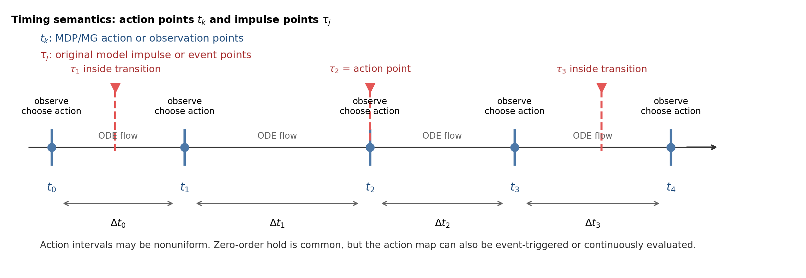

# Continuous, Impulse, Hybrid, MDP, And Markov Game Guide

This repository uses one cyber propagation model in several forms.  The key is to keep the timing convention explicit.

## Decision Timeline

At decision epoch `k`, the learning environment uses this order:

```text
observe s_k = x(t_k^-)
  -> choose defender action a_D,k and, for games, attacker action a_A,k
  -> apply any instantaneous jump x(t_k^+) = G(x(t_k^-), a_D,k, a_A,k)
  -> integrate ODE flow over [t_k, t_{k+1})
  -> return s_{k+1} = x(t_{k+1}^-), rewards, done, diagnostics
```

The policy observes the pre-jump state `x(t_k^-)`.  The next observation is the state just before the next decision point, `x(t_{k+1}^-)`.  If an action has no jump effect, then `x(t_k^+) = x(t_k^-)` and only the ODE rates change over the interval.

Notation used throughout this repo:

| Symbol | Meaning |
|---|---|
| `t_k` | action/observation point after converting the simulator into an MDP or Markov game |
| `Delta t_k = t_{k+1} - t_k` | action interval; it may be fixed or nonuniform |
| `tau_j` | impulse or event point already present in the original continuous/hybrid model |
| RK4 substeps | internal solver points inside one action interval, not learner decisions |

The checked-in environment uses a fixed `EnvConfig.dt` because that is easiest to read and test.  The mathematical conversion does not require fixed intervals.  A nonuniform schedule `0=t_0<t_1<...<t_K=T` is valid if the simulator and reward use the matching `Delta t_k`.



## Three Control Types

| Type | Mathematical object | Code location | Does the state jump? |
|---|---|---|---|
| Continuous-time control | `u(t)` appears in the ODE right-hand side. | `fbsm_malware_baseline.py`, `controlled_sir_rhs` | No |
| Impulse control | `x(t_k^+) = G(x(t_k^-), a_k)` at selected times. | `HybridCyberDefenseEnv.jump_map` | Yes |
| Hybrid sampled action | discrete mode plus intensity `(m_k, v_k)`; may set rates, jumps, or both. | `decode_action`, `defense_parameters`, `attack_parameters` | Depends on the mode |

In the current environment, `DEF_ISOLATE` is impulsive because it immediately moves a fraction of compromised devices into the protected compartment.  `DEF_PATCH`, `DEF_CLEAN`, and `DEF_DECEIVE` mainly change ODE rates during the next decision interval.

## What Is Discretized?

There are two different grids.  They should not be confused.

| Grid | Meaning | Used by | Is it an RL decision point? |
|---|---|---|---|
| Continuous-control integration grid | Numerical time mesh for solving ODE/PMP equations. | FBSM baseline | No |
| Decision grid `0=t_0<...<t_K=T` | Times where policies observe the state and choose actions. Fixed `t_k=k Delta t` is only one case. | DDQN MDP, compact CTDE/MAPPO Markov game | Yes |
| RK4 substeps inside one interval | Internal solver steps used to integrate from `t_k` to `t_{k+1}`. | Hybrid environment | No |

FBSM does not convert the original process into an MDP.  It solves a continuous-time optimal-control problem on a numerical mesh.  DDQN, compact CTDE, and MAPPO convert the continuous/hybrid simulator into a sampled-data MDP or Markov game by exposing only the decision grid to the learning algorithm.

## Does Learning Always Require Discretization?

Not always in the same sense.  Model-free RL/MARL usually needs sampled transitions `(s_k, a_k, r_k, s_{k+1})`, so the simulator must expose decision epochs.  PINN/PIDL and Neural ODE methods may train on sampled or collocation points while still representing a continuous-time residual.  FBSM uses a numerical mesh for computation, but it is not an MDP conversion.

Zero-order hold is the simplest sampled-data convention:

```text
choose a_k at t_k
apply the corresponding control over [t_k, t_{k+1})
```

That makes the applied control piecewise constant.  It is common, but not mandatory.  Alternatives include piecewise-linear controls, event-triggered impulses, continuous actor outputs inside a differentiable ODE solver, or a feedback law evaluated continuously.

## Original Impulse Times And Learning Decision Times

Some models already have impulse times before learning is introduced.  Keep those times separate from the learning decision grid.  In this guide, `tau_j` always refers to original model impulse/event times, while `t_k` always refers to learning action/observation times.

| Relationship | Meaning | Implementation |
|---|---|---|
| original impulse times equal decision times | every learning action may create a jump | standard hybrid MDP or Markov game |
| original impulse times are a subset of decision times | only some epochs allow impulse actions | action mask or time-dependent action set |
| original impulse times are denser than decision times | simulator has events the learner does not choose | include those events inside the transition |
| policy chooses impulse timing | timing itself is part of the action | semi-MDP or event-triggered policy |

If `tau_j` falls strictly between `t_k` and `t_{k+1}`, the learner does not choose that event directly.  The simulator should apply the event inside the transition and include its effect in `s_{k+1}` and `r_k`.  If `tau_j=t_k`, the impulse can be exposed as part of the learner's action at that decision epoch.

## MDP Conversion

For the single-defender DDQN example, the induced MDP is:

```text
s_k      = observation at t_k
a_k      = defender action
P        = simulator transition defined by jump_map + ODE integration
r_k      = integrated defender reward over [t_k, t_{k+1}), using Delta t_k
s_{k+1}  = next observation at t_{k+1}
```

The replay buffer stores `(s_k, a_k, r_k, s_{k+1}, done)`.  The internal RK4 substeps produce a better transition estimate, but they do not create extra replay items.

## Markov Game Conversion

For the attacker-defender example, the induced Markov game is:

```text
s_k        = shared simulator state at t_k
a_D,k      = defender action
a_A,k      = attacker action
P          = simulator transition defined by joint action, jump_map, and ODE flow
r_D,k      = defender reward
r_A,k      = attacker reward
s_{k+1}    = next simulator state
```

The CTDE script uses centralized critics that see the state and both actions during training.  The actors are decentralized policies that map observations to defender or attacker actions.  The node-SIPRS MAPPO script uses the same decision-grid idea but trains cooperative community defenders with PPO-style clipped updates.  The large node-SIPRS attacker-defender script keeps both players at the community level: defenders choose patch/clean communities under a budget, attackers choose communities receiving a temporary infection-pressure boost, and the response matrix evaluates unilateral policy changes on the same simulator.

## Code Checklist

When adapting the model, decide these items before training:

1. What is observed at `t_k`: full state, partial state, alerts, budget, or time-to-go?
2. Which actions cause immediate jumps?
3. Which actions only change continuous rates during `[t_k, t_{k+1})`?
4. Is the action schedule fixed `Delta t` or nonuniform `Delta t_k`?
5. How many solver substeps are used inside each decision interval?
6. Is the algorithm solving a continuous-control problem, an MDP, or a Markov game?

The environment records timing and transition diagnostics in the `info` dictionary returned by `step`.
